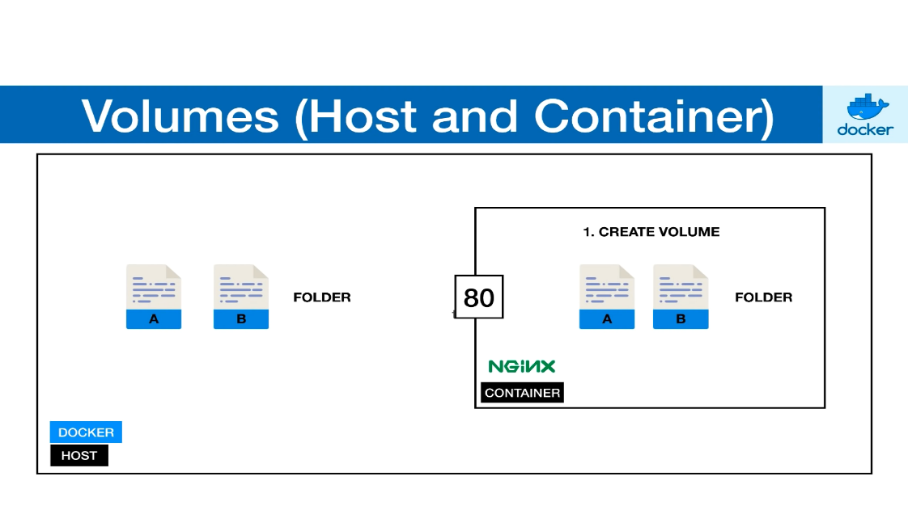

# **Docker Notes**

`images ` - A set of instructions used to build the docker container like a template.

`container` - Is a running instance of the docker image.

---

## **Pulling Docker Images:**

`sudo docker pull <docker image>`

## **To list the docker images in our machine:**

`sudo docker images`

---

## **To run a docker image:**

`sudo docker run <image name:tag>`

***To run in the detached mode run,***

`sudo docker run -d <imagename:tag>`

***To map the local machine port to the container port***

`sudo docker run -p <localhost port>:<container port> <imagename:tag>`

***Mapping multiple local machine port to container port***

`sudo docker run -p <port1>:<container port> -p <port2>:<container port> -p <portn>:<container port> <imagename:tag>`

---

## **To list the running containers:**

`sudo docker ps`

`sudo docker container ls`

***Docker will have both running and stopped containers. The above commands will show only the running ones. To show all the containers***

`sudo docker ps -a`

***To show only the container id of all containers, q denotes quiet***

`sudo docker ps -aq`

*This will output Container ID, Image name, Command etc...*

---

## **To stop a running container:**

`sudo docker stop <container ID>`

or

`sudo docker stop <container name>`

---

## **To remove a container**

`sudo docker rm <container ID or container name>`

***To remove a running container, we need to force the docker to do it***

`sudo docker rm -f <container ID or container name>`

***To remove all the containers (-f is used to remove the running containers also)***

`sudo docker rm -f $(sudo docker ps -aq)`

---

## **To start a stopped container**

`sudo docker start <container ID or name>`

---

## **Naming a Container**
***A container can be named appropriately instead of any random name that docker gives***

`sudo docker run -- name <preferred name for conatiner> <image name: tag>`  

---

# **How to change the port of an existing containers**

It can be done in 2 methods:

> editing the `hostconfig.json` file in `/var/lib/docker/containers/[hash of conatiner]/hostconfig.json`
> 
> container hash can be found using `sudo docker inspect <container name>`
> 
> 1. Stop the container using `sudo docker stop <container id or name>`
> 2. Stop the docker service `sudo systemctl stop docker`
> 3. Change the port number in `hostconfig.json` file
> 4. Restart docker engine to clear the config caches using `sudo systemctl restart docker`
> 5. Start the container using `sudo docker start <container id or name>`

> 1. Stop the container `sudo docker stop <container id or name>`
> 2. Commit the old container to new container `sudo docker commit <old container name> <new container name>`
> 3. Remove the old container `sudo docker rm <container id or name>`
> 4. Start the new container `sudo docker run -d -p <host port>:<container port> <new container name>`

> To Change the mount point edit `config.v2.json` and change the `Source` path under `MountPoint`
---

# **Volumes**

> Allows sharing of data or folders between conatainer and host and vice versa
> 
> Can be share between the conatainers

> `File A` created in the host will automatically appear in the container
> 
> `File B` created in the conatiner will appear in the host
>
> Same with the `Folders` also

`sudo docker run -v <host path>:<container path>:<access mode> <image name>`

> Access mode **read only** can be specified as `ro` or `read only`
>
> `path` must be `absolute path`

***Example***
`sudo docker run --name website -d -p 8080:80 -v $(pwd):/usr/share/nginx/html:ro nginx`

### **To execute bash command from the container**

`sudo docker exec -it <container id or name> <bash command>`

***Example***

`sudo docker exec -it website bash`

> The option `-i` stands for interative mode and `-t` stands for allocate pseudo tty
> 
> The above example will login into container's bash shell

# **Sharing volumes between containers**

`sudo docker run --volumes-from <source container> <image name>`

---

# **Dockerfile**

[CheatSheet](https://kapeli.com/cheat_sheets/Dockerfile.docset/Contents/Resources/Documents/index)

> To build our own images
> 
> Image should have all the dependencies we need to run the application
> 
> OS, Source code, Softwares
> 
> `FROM <base image>` - base image is the basic image that our application need to run
> 
> `ADD <source path> <destination path>` - This will copy all the source code in to our image. Source path is the source path of the source code in our machine. Destination path is the place to which we copy our code into image.
>
> `WORKDIR <workdir path>` - This will set the working directory for any command (RUN, CMD, etc..) that follow it in the Dockerfile. If WORKDIR doesn't exist in the container it will be created.
> 
> `RUN <command>` - This will run the `<command>` inside of the docker image.
> 
> `CMD <command>` - This will let us define the default command to run when the container start.

> The image can be build by running `build` command
> 
> `sudo docker build --tag <image name>:<tag name> <Dockerfile path>`

## **dockerignore**

> We need to avoid certain files to be included into our docker image.
>
> For example: if we need to avoid `Dockerfile` to be included into our final image, since it doesn't contribute to anything in our image, we can add it in the `.dockerignore` file.

---

# **Tags and Versioning**

> Allows us to build images with different tags and images
> 
> `Example:` If we are using `node:alpine` as the base image for our application the current version of `node` may be `version 8`. After sometime `node` version may be increased to say `version 12`. So our application may break. To resolve that we can chose our base image's specified version like `node:8-alpine`.
>
> When we didn't mention tag name, docker will always consider the tag as `latest`. Even the `latest` image is not present it will `pull` it from the docker registry.

## **Tagging own images**

Create a tag TARGET_IMAGE that refers to SOURCE_IMAGE

`docker tag SOURCE_IMAGE[:TAG] TARGET_IMAGE[:TAG]`

---

# **Docker registry**

> Highly scalable server side application that stores and distribute docker images
> By pushing our images to docker registry using `docker push`
